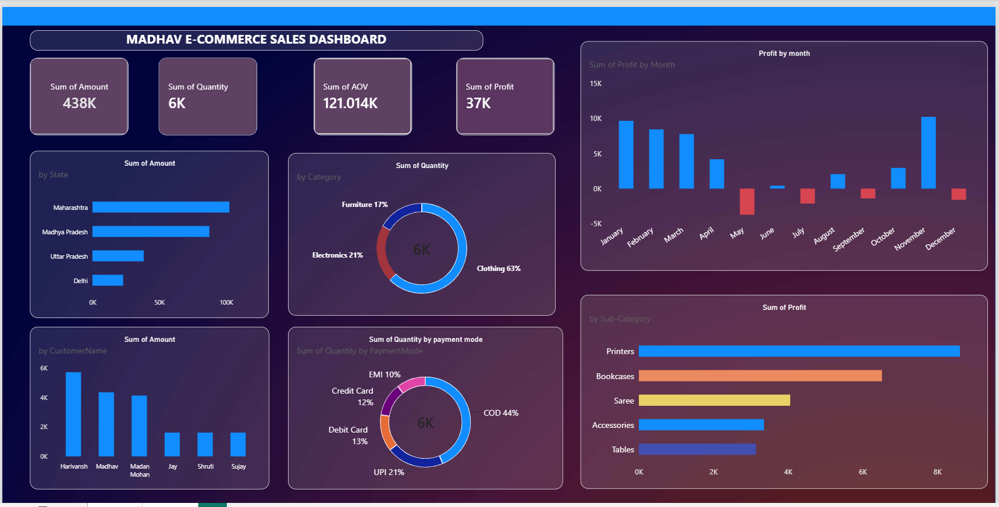

# PowerBI-Sales-Analysis-Dashboard
Interactive sales analysis and performance dashboard built using Microsoft Power BI.
## Dashboard Preview

# 📊 Power BI Sales Analysis Dashboard

## 📌 Project Overview

This project is an interactive **Sales Analysis Dashboard** created using Microsoft Power BI. The dashboard analyzes sales performance across products, states, quantity, selling price, and product cost to identify important business trends and insights.

## 🛠️ Tools & Technologies

- **Power BI**
- **DAX**
- **Power Query**
- **Data Cleaning & Transformation**
- **Data Visualization**

## 📂 Dataset

The dataset contains sales-related information such as:

- Order ID
- Product ID
- Product
- Product State
- Selling Price
- Product Cost
- Quantity

## 🔍 Key Analysis

The dashboard was created to analyze:

- Total Sales
- Total Product Cost
- Profit/Revenue performance
- Quantity sold
- Product-wise performance
- State-wise sales performance
- Overall sales trends

## 📊 Dashboard Preview

## 💡 Key Insights

The dashboard helps identify:

- Products generating higher sales
- States contributing significantly to sales
- Differences between selling price and product cost
- Quantity-based sales performance
- Overall business sales performance

## 📁 Files Included

- `PowerBI-Sales-Analysis-Dashboard.pbix` — Power BI dashboard file
- `dashboard.png` — Dashboard preview

## 🎯 Skills Demonstrated

- Data cleaning
- Data transformation
- DAX calculations
- Data analysis
- Interactive dashboard development
- Business-focused data visualization

## 👨‍💻 Author

**Ayushman Singh**

Aspiring Data Analyst | Power BI | SQL | Python | Excel
